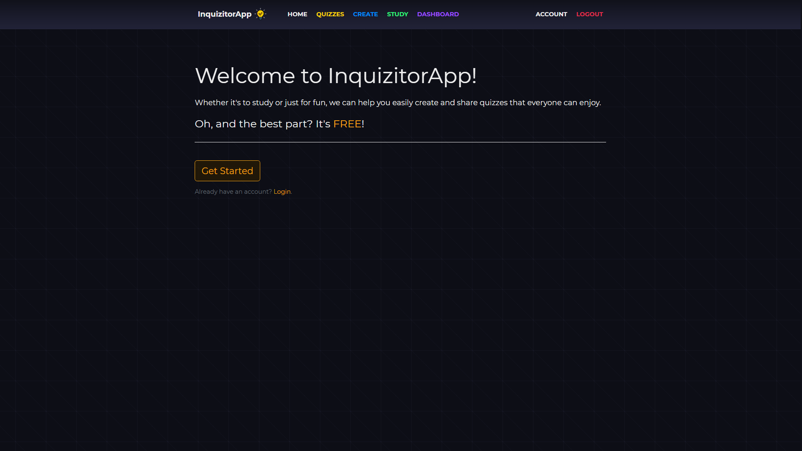
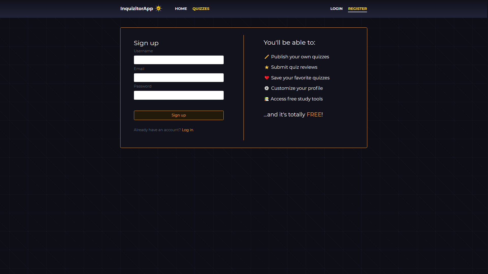
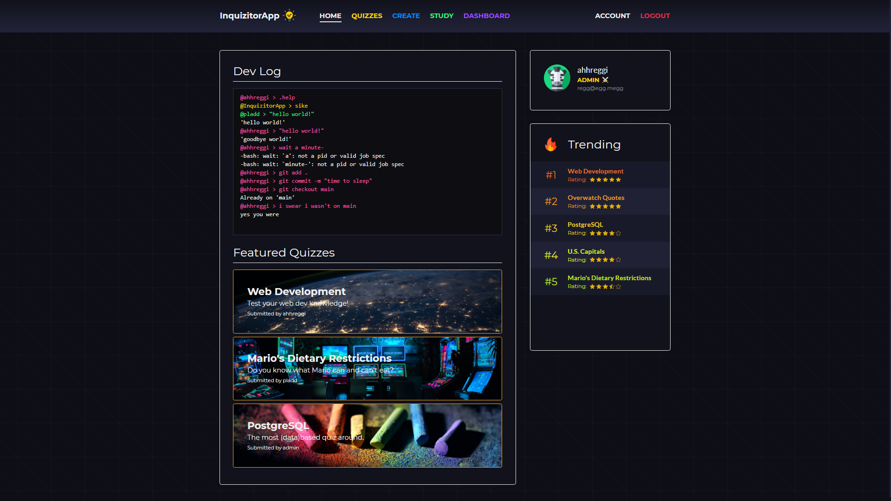
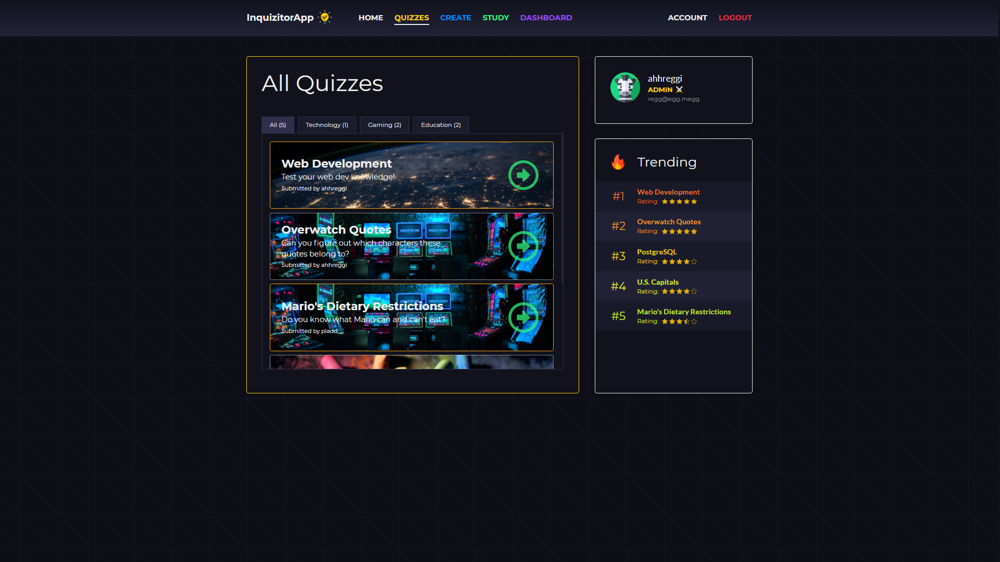
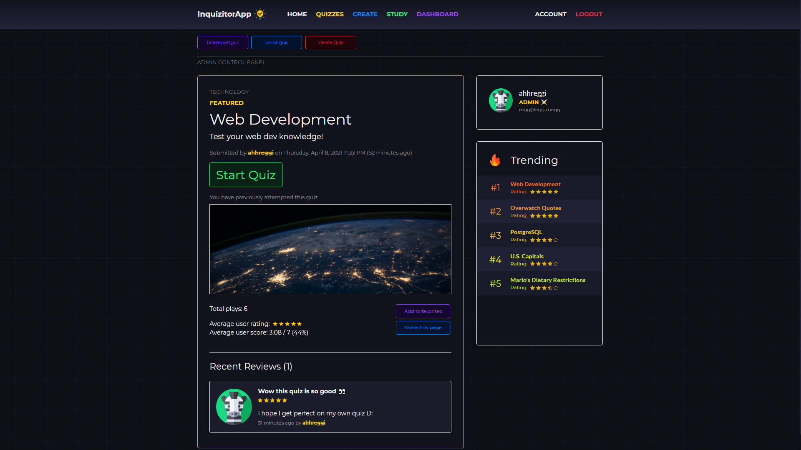
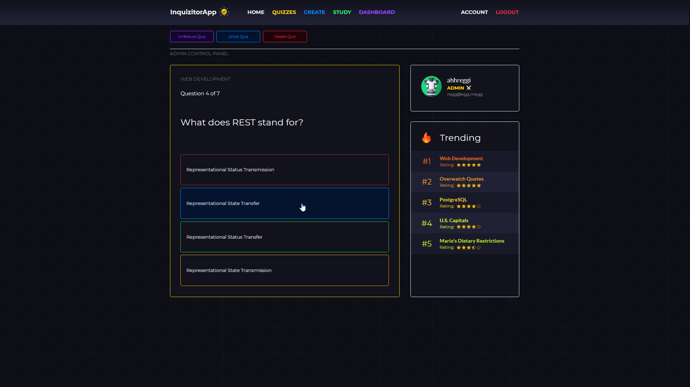
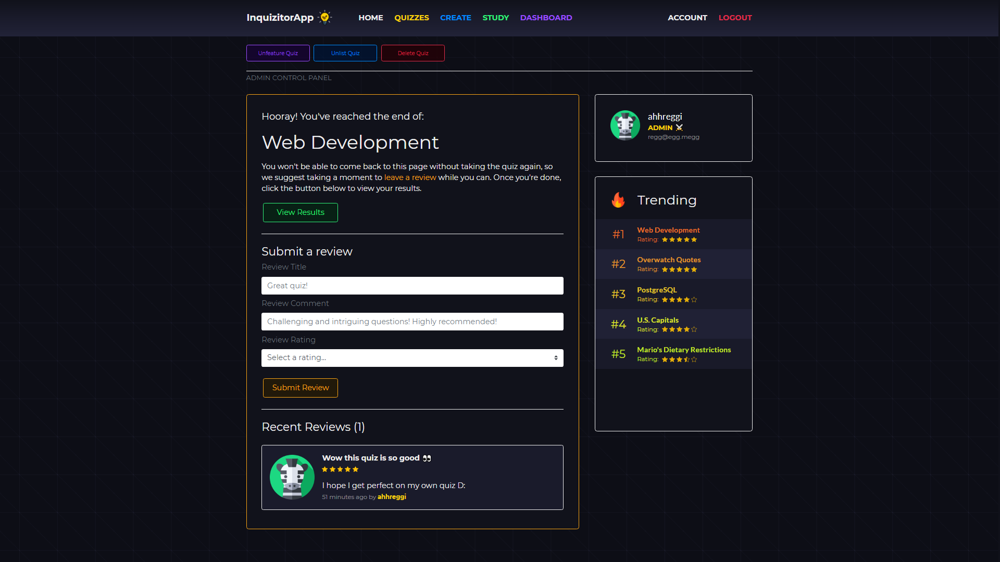
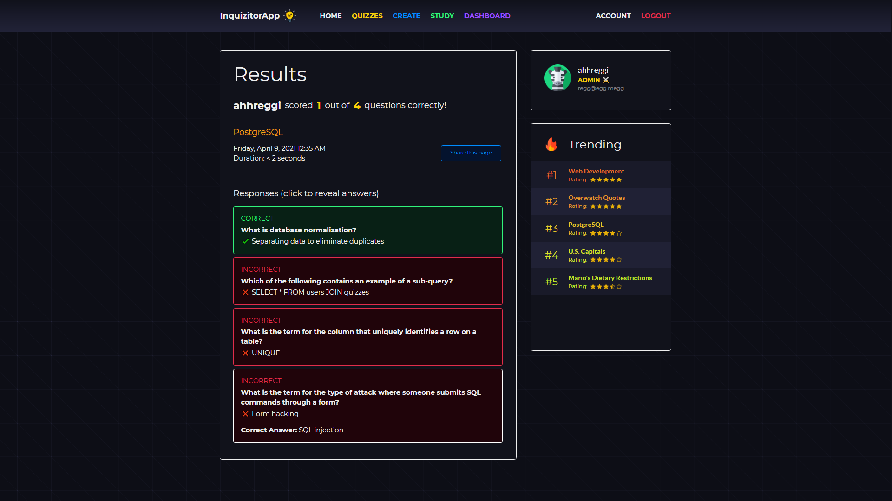
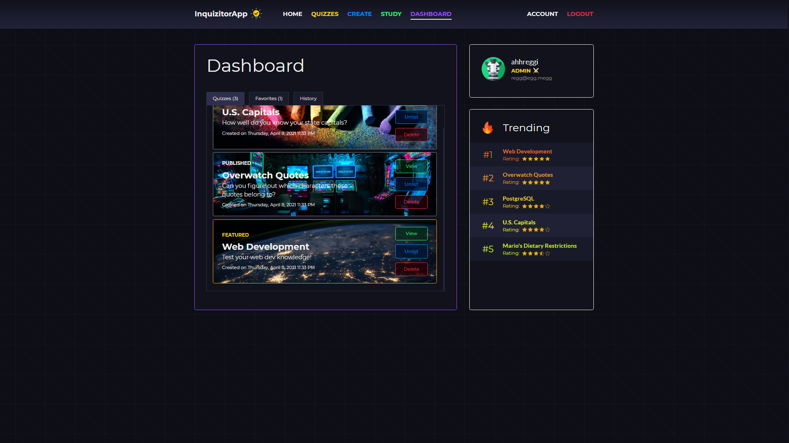
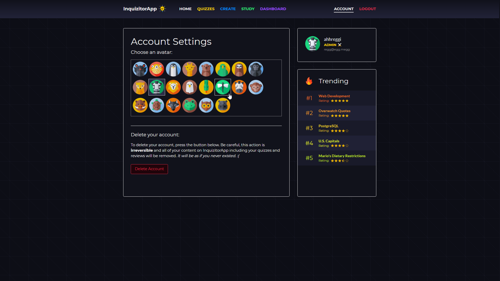

<!-- TITLE -->
<div align="center">

<h1>InquizitorApp</h1>
<p>A full-stack application for generating and sharing quizzes
</p>

<p>Built with <a href="https://nodejs.org/en/">Node.js</a>, <a href="https://expressjs.com/">Express</a>, <a href="https://www.postgresql.org/">PostgreSQL</a>, <a href="https://jquery.com">jQuery</a>, CSS/<a href="https://sass-lang.com/">SASS</a>, <a href="https://getbootstrap.com/docs/4.6/">Bootstrap 4</a>, and hosted with <a href="https://www.heroku.com/">Heroku</a></p>

<b><a href="https://inquizitor-app.herokuapp.com/" target="_blank">
   » View Live Demo «
</a></b>

</div>

<!-- INTRODUCTION -->

## 📚 Introduction

<b>[InquizitorApp](https://inquizitor-app.herokuapp.com/)</b> is a RESTful, responsive full-stack web application that allows users to create, modify, and take quizzes, as well as share their results.

Created by Maria Regina Sirilan ([**@ahhreggi**](https://github.com/ahhreggi)) and Paul Ladd ([**@pladd**](https://github.com/itspladd)).

This app was created as part of our midterm project for Lighthouse Labs' Web Development bootcamp. The goal was to create a full-stack application from start to finish in just one week.

<b>Built with <a href="https://nodejs.org/en/">Node.js</a>, <a href="https://expressjs.com/">Express</a>, <a href="https://www.postgresql.org/">PostgreSQL</a>, <a href="https://jquery.com">jQuery</a>, CSS/<a href="https://sass-lang.com/">SASS</a>, and <a href="https://getbootstrap.com/docs/4.6/">Bootstrap 4</a>.</b>

<!-- FEATURES -->
## ⭐ Features
- Login by username/email or register an account
- Create and attempt public and unlisted quizzes
- View all public quizzes by category, trending, or featured
- Submit quiz reviews
- Share quiz results via unique links
- Add quizzes to your favorites
- **Dashboard:** View/modify your quizzes, favorites, and history
- **Account settings:** Customize your account avatar or delete your account
- **Admin accounts:** Special nametags + access to a control panel that overrides all permissions to delete, publish/unlist, or feature a quiz on the front page

## 📝 Dev Notes

Maria Regina Sirilan ([**@ahhreggi**](https://github.com/ahhreggi)) - *Front-end, UI/UX, API*

> My goal was to create a mobile-first, responsive UI that would help make the user experience as seamless as possible. Every bit of the app is designed with contextual feedback in mind - to provide relevant information to the user through visuals alone so that the UI could remain simple and intuitive. I also focused on scalability early on by dispersing assets and utilities into modular components. This minimized the variety of data passed between the client and server, making it significantly easier to implement additional stretch features towards the end while maintaining a high degree of customizability. Huge props to Paul (and his GOD queries) for holding our crazy database together and keeping up with my requests for progressively granular data! - Reggi ✌️

Paul Ladd ([**@pladd**](https://github.com/itspladd)) - *Back-end architecture, database, API*

> Paul is the GOD querier and very well-rehearsed about Mario's dietary restrictions.

<!-- INSTALLATION -->

## 🛠 Installation

The project is live
<b><a href="https://inquizitor-app.herokuapp.com/" target="_blank">here</a></b>, but if you would prefer a local installation:

1. Clone or download this repository
   ```
   git clone https://github.com/itspladd/quiz-app
   ```
2. Navigate to the project directory and install dependencies
   ```
   cd quiz-app
   npm install
   ```
3. Launch the development web server
   ```
   npm run local
   ```
4. Visit <a href="http://localhost:8080/">http://localhost:8080/</a> on your browser

## 📷 Screenshots










